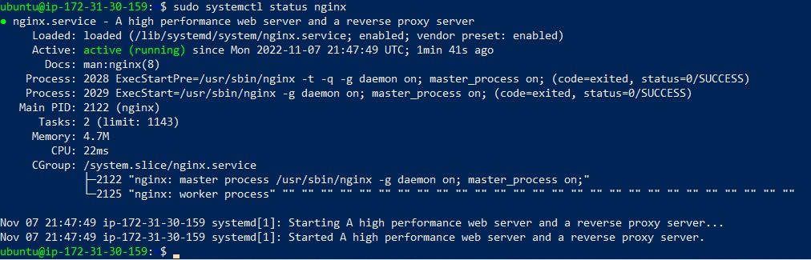
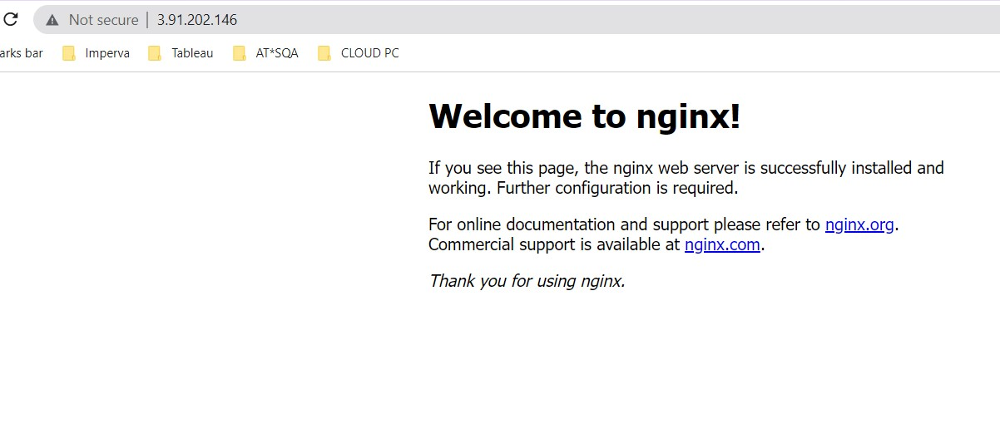
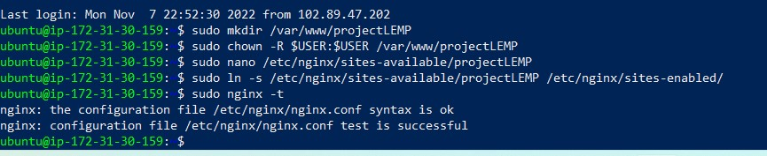
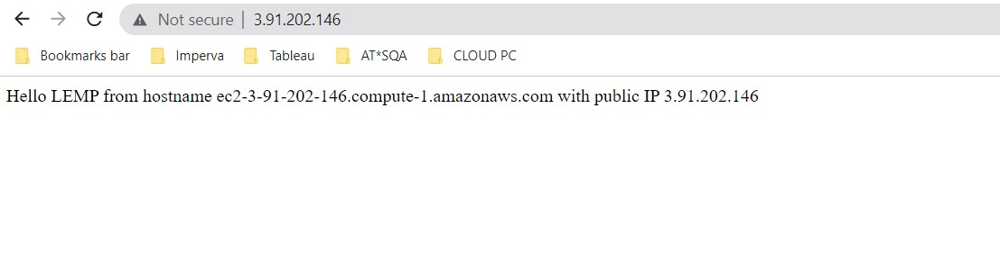
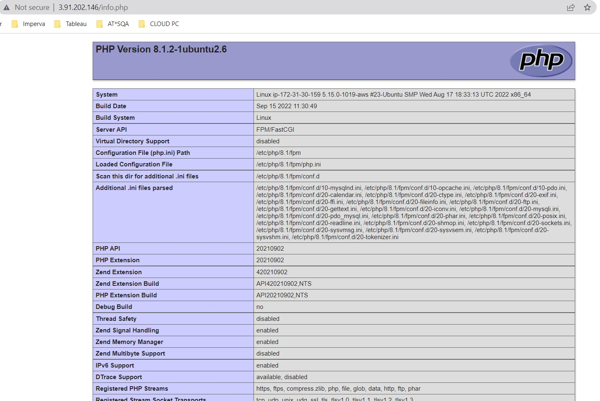
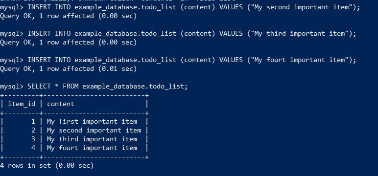
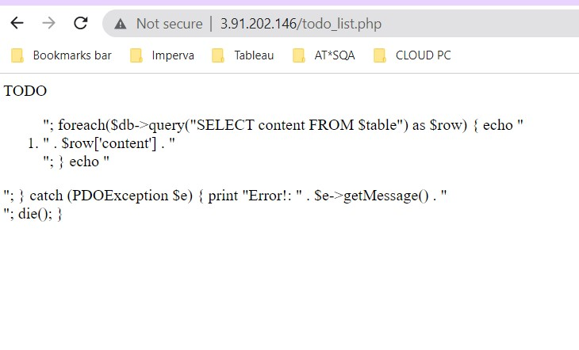

## My Documentation on LEMP Stack Implementation

In order to complete this project I had to setup a virtual server with Ubuntu Server OS. This is an EC2 Instance of t2.nano family with Ubuntu Server 22.04 LTS (HVM) image.

**STEP 1 – INSTALLING THE NGINX WEB SERVER**        

In order to display web pages to my site visitors, I installed the Nginx high-performance web server using the apt package manager to install this package:

`sudo apt update`       
`sudo apt install nginx`        

To verify that nginx was successfully installed and is running as a service in Ubuntu, run:

`sudo systemctl status nginx`       

Before we can receive any traffic by our Web Server, we need to open TCP port 80. First, to check how we can access it locally in our Ubuntu shell, run:

`curl http://localhost:80`  or  `curl http://127.0.0.1:80`

Then tested if my Nginx server can respond to requests from the Internet. From a web browser try to access following url:       
http://*Public-IP-Address*>:80

Result:

**STEP 2 — INSTALLING MYSQL**

To install MySQL database which is a popular relational database management system used within PHP environments,
I used ‘apt’ to acquire and install this software:

`sudo apt install mysql-server`     

When the installation is finished, log in to the MySQL console by typing:       
`sudo mysql`

The result below:

     

It’s recommended to run a security script that comes pre-installed with MySQL. This script will remove some insecure default settings and lock down access to your database system. Before running the script you will set a password for the root user, using mysql_native_password as default authentication method.

`ALTER USER 'root'@'localhost' IDENTIFIED WITH mysql_native_password BY 'your password'

Then `exit` mysql shell.

Started the interactive script by running:

` sudo mysql_secure_installation`       

Then test the installation using the script below:      

`sudo mysql -p`

Then exit mysql console: 
`mysql> exit`

MySQL server is now installed and secured. Next, we will install PHP, the final component in the LEMP stack.

**STEP 3 – INSTALLING PHP**

With Nginx installed to serve my content and MySQL installed to store and manage my data, next is to install PHP to process code and generate dynamic content for the web server.       
I'll need to install php-fpm, which stands for “PHP fastCGI process manager”, and tell Nginx to pass PHP requests to this software for processing. Additionally, you’ll need php-mysql, a PHP module that allows PHP to communicate with MySQL-based databases. Core PHP packages will automatically be installed as dependencies.

To install these 2 packages at once, run:

`sudo apt install php-fpm php-mysql`

With PHP components successfully installed, next is to configure the nginx to use them.

**STEP 4 — CONFIGURING NGINX TO USE PHP PROCESSOR**

On Ubuntu 20.04, Nginx has one server block enabled by default and is configured to serve documents out of a directory at /var/www/html. Instead of modifying /var/www/html, created a directory structure within /var/www for the my_domain website, leaving /var/www/html in place as the default directory to be served if a client request does not match any other sites.

Create the root web directory for your_domain as follows:   
`sudo mkdir /var/www/projectLEMP`       

Next, assigned ownership of the directory with the $USER environment variable, which will reference your current system user:

`sudo chown -R $USER:$USER /var/www/projectLEMP`        

Then, open a new configuration file in Nginx’s sites-available directory using your preferred command-line editor. Here, we’ll use nano:
I tested my hands on the nano editor.

`sudo nano /etc/nginx/sites-available/projectLEMP`      

Activated my configuration by linking to the config file from Nginx’s sites-enabled directory:

`sudo ln -s /etc/nginx/sites-available/projectLEMP /etc/nginx/sites-enabled/`               

This tells Nginx to use the configuration next time it is reloaded. Tested my configuration for syntax errors by typing:        

`sudo nginx -t`

See output below:       

      

Also disabled default Nginx host that is currently configured to listen on port 80, for this run:

`sudo unlink /etc/nginx/sites-enabled/default`      

When you are ready, reload Nginx to apply the changes:

`sudo systemctl reload nginx`

With my new website active, but the web root /var/www/projectLEMP is still empty. I created an index.html file in that location so that we can test that our new server block works as expected:

sudo echo 'Hello LEMP from hostname' $(curl -s http://169.254.169.254/latest/meta-data/public-hostname) 'with public IP' $(curl -s http://169.254.169.254/latest/meta-data/public-ipv4) > /var/www/projectLEMP/index.html       

Tested using my public IP:80 and see result below:

**STEP 5 – TESTING PHP WITH NGINX**

My LEMP stack should now be completely set up. To validate that Nginx can correctly handle .php files off to your PHP processor. This can be done by creating a test PHP file in my document root. Open a new file called info.php within your document root in your text editor:

`sudo nano /var/www/projectLEMP/info.php`       

Type or paste the following lines into the new file. This is valid PHP code that will return information about your server:

`<?php
phpinfo();`     

Test it out on the web browser with my public IP and /info.php:

However, it’s best to remove the file created as it contains sensitive information about my PHP environment and Ubuntu server. You can use rm to remove that file:

`sudo rm /var/www/your_domain/info.php`

**STEP 6 – RETRIEVING DATA FROM MYSQL DATABASE WITH PHP (CONTINUED)**       

First, connect to mysql condole using the root account:

`sudo mysql`        

Created a new database, ran the following command from your MySQL console:

`mysql> CREATE DATABASE example_database;`      

Then created a new user - example_user:

`mysql>  CREATE USER 'example_user'@'%' IDENTIFIED WITH mysql_native_password BY 'password';`

Granted the user permission over the *example_database*

`mysql> GRANT ALL ON example_database.* TO 'example_user'@'%';`

Now exited my SQL shell:

`mysql> exit`

To test if the new user has the proper permissions by logging in to the MySQL console again, this time using the custom user credentials: 

`mysql -u example_user -p`

Then confirmed my access to DB:

`mysql> SHOW DATABASES;`

      

Then created a test table named todo_list. From the MySQL console, ran the following statement:

`CREATE TABLE example_database.todo_list (item_id INT AUTO_INCREMENT, content VARCHAR(255), PRIMARY KEY(item_id));`     

Inserted a few rows of content in the test table and repeated it to get more rows:

To check if database is populated: use the querry:
`SELECT * FROM example_database.todo_list;`

Result:
        

To create a PHP script that will connect to MySQL and query for my content. Create a new PHP file in your custom web root directory using the vi editor:

`nano /var/www/projectLEMP/todo_list.php`

Copy this content into your todo_list.php script:       

*<?php
$user = "example_user";
$password = "password";
$database = "example_database";
$table = "todo_list";

try {
  $db = new PDO("mysql:host=localhost;dbname=$database", $user, $password);
  echo "<h2>TODO</h2><ol>";
  foreach($db->query("SELECT content FROM $table") as $row) {
    echo "<li>" . $row['content'] . "</li>";
  }
  echo "</ol>";
} catch (PDOException $e) {
    print "Error!: " . $e->getMessage() . " ";
    die();
}*     

And then gets accessed from my web browser:

http://<Public_domain_or_IP>/todo_list.php      

  

This means that my PHP environment is ready to connect and interact with my MySQL server.

